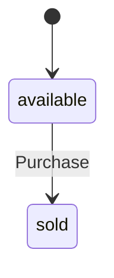

# hecks

hecks is an **executable domain specification language**. A `.bluebook`
file declares a business domain — aggregates, value objects, commands,
invariants, policies, queries — and that declaration *is* the running
system. There is no handler code, no separate implementation to keep in
sync: `given` guards a command, `sets` mutates state, `emits` announces
an event, and the runtime dispatches all of it directly from the
declaration. A domain is data, so it can be read, diffed, versioned, and
compiled into another language the same way any other data can.

The language surface is small: [22 contexts](docs/implemented/reference/index.md),
every one of them documented with a runnable example. Most of what's
below fits on one screen. [Getting started](docs/implemented/guides/getting-started.md)
is a five-minute read from zero to a booted domain.

Ruby is the reference implementation. A generated Rust runtime reads the
same canonical IR and runs the same domain, checked against Ruby
continuously — see [Runtimes](#runtimes).

## Quickstart

```sh
bin/console
```

Booting installs the door, so a domain is just Ruby:

<!-- doctest:boot
Kernel.load(File.join(InMemoryDomain::ROOT, "examples/pizzas/bluebook/pizzas.bluebook"))
Hecks.hecksagon("Pizzas") do
  uses_framework "Governance"
  Pizzas::Order.persisted_by("Memory")
end
Hecks.hecksagon("Governance") do
  Governance::RoleAssignment.persisted_by("Memory")
  Governance::RoleTransition.persisted_by("Memory")
end
-->

```ruby
order = Order.create_pizza!(name: { value: "Margherita" }, pizza: { price_cents: { cents: 1200 }, size: { value: "large" } })
order.add_topping!(topping: { value: "Basil" }, amount: { value: 3 })
order.purchase!(customer_name: { value: "Chris" }, amount: { cents: 1200 })

order.status             # => "sold"
order.events.last.name   # => "PizzaPurchased"

Order.count              # => 1
Order.find(order.id).customer_name.to_h   # => { value: "Chris" }
```

That block runs on every push, claims and all — not an illustration. So
does every other `ruby`-fenced example in this README and in
`docs/implemented/guides/`; `spec/guides_spec.rb` is the harness.

A creating command is a module method and returns the new record. A
command on an existing record is a method on that record — identity is
already known — and returns `self`, so commands chain. `bin/run <domain>
<script.json>` executes a step list of commands and queries from JSON and
reports events, refusals, and rows; `bin/fuzz` generates and runs these
scripts itself, checked against declared properties.

## Guides

<!-- generated:begin id=guides -->
- [Aggregates and value objects](docs/implemented/guides/aggregates-and-value-objects.md)
- [Behaviors](docs/implemented/guides/behaviors.md)
- [Commands](docs/implemented/guides/commands.md)
- [Entities](docs/implemented/guides/entities.md)
- [Extending Hecks](docs/implemented/guides/extending-hecks.md)
- [Getting started](docs/implemented/guides/getting-started.md)
- [Guides](docs/implemented/guides/index.md)
- [Lifecycles](docs/implemented/guides/lifecycles.md)
- [Policies and process managers](docs/implemented/guides/policies-and-process-managers.md)
- [Queries and read models](docs/implemented/guides/queries-and-read-models.md)
- [Running a runtime](docs/implemented/guides/running-a-runtime.md)
- [Schema evolution](docs/implemented/guides/schema-evolution.md)
- [Verification](docs/implemented/guides/verification.md)
- [Wiring](docs/implemented/guides/wiring.md)
- [Writing an adapter](docs/implemented/guides/writing-an-adapter.md)
<!-- generated:end -->

## Reference

<!-- generated:begin id=reference -->
[The DSL reference](docs/implemented/reference/index.md) — 22 contexts, generated from the aggregate-local tables under `lib/hecks/language/` and held to them by `spec/reference_golden_spec.rb`.
<!-- generated:end -->

## More docs

- **Resolution rules** — the exact algorithm behind every piece of DSL
  sugar that lets a bluebook omit something the runtime can derive:
  [overview](docs/resolution-rules/README.md),
  [cross-entity given](docs/resolution-rules/cross-entity-given.md),
  [chapter-given](docs/implemented/resolution-rules/chapter-given.md),
  [implicit append fields](docs/implemented/resolution-rules/implicit-append-fields.md),
  [implicit command attributes](docs/implemented/resolution-rules/implicit-command-attributes.md).
- **Decision log** — [`docs/decisions/`](docs/decisions/) and
  [`docs/implemented/decisions/`](docs/implemented/decisions/), one
  document per architectural decision.
- **Language specification docs** — [the query DSL](docs/query-dsl.md),
  [command/query form](docs/command-form-and-query-form-bluebook.md),
  [Rails integration](docs/rails-integration.md).
- [`docs/HECKS_IMPLEMENTATION_PLAN.md`](docs/HECKS_IMPLEMENTATION_PLAN.md)
  — the full architecture in one document.

## The domain: bluebook, hecksagon, world

A domain is three files. `.bluebook` declares what the domain *is* —
aggregates, commands, rules — independent of how any deployment runs it.
`.hecksagon` wires it to real ports: which adapter persists it, which
framework it attaches to, which ports it exposes. `.world` holds the one
thing neither of those names — per-deployment values, like a database
URL or a Lambda's memory limit. Each file below is real, trimmed to the
pieces this section shows; the untrimmed originals are
`examples/pizzas/bluebook/`.

```ruby skip
examples/pizzas/
  bluebook/
    pizzas.bluebook        the domain
    pizzas.hecksagon       the wiring
    pizzas.world           the per-deployment values
  data/
```

### bluebook

```ruby skip
aggregate "Order" do
  identified_by :name

  attribute :name,     PizzaName
  attribute :toppings, list_of(Topping)

  value_object "PizzaName" do
    attribute :value, String

    invariant("a pizza is named") { !value.to_s.empty? }
  end

  value_object "Topping" do
    attribute :name,   String
    attribute :amount, Integer
  end

  lifecycle :status, default: "available" do
    transition "Purchase" => "sold", from: "available"
  end

  command "CreatePizza" do
    role "Chef"
    goal "Put a new pizza on the menu"

    attribute :name,  PizzaName
    attribute :pizza, Pizza

    emits "PizzaCreated"
  end

  command "AddTopping" do
    role "Chef"
    goal "Customize a pizza with an ingredient"

    reference_to Order
    attribute :topping, ToppingName
    attribute :amount, ToppingAmount

    given("a sold pizza cannot be changed") { status == "available" }
    given("at most 10 toppings")            { toppings.size < 10 }

    sets :toppings, append: { name: :topping, amount: :amount }

    emits "ToppingAdded"
  end
end
```

`given` refuses before `sets` runs; a value object's own `pattern:`
refuses before its own invariant does — checked in that order, on the
same booted domain as the Quickstart above:

```ruby
Order.create_pizza!(name: { value: "" }, pizza: { price_cents: { cents: 900 }, size: { value: "small" } })   # ~> TypeMismatch: PizzaName.value must match [^ \t\n\r], got ""
```

A command's mutation either replaces a field (`sets :status, to:
"sold"`) or appends to a list (`sets :toppings, append: ...`, above).
Some domains need a number that raises rather than replaces — an
account's balance, for example:

```ruby bluebook
Hecks.bluebook "Banking" do
  vision "Customers hold accounts, accounts move money, and every movement is a transfer that can fail halfway. The domain that has to get it right twice — once in the rules, once in the recovery."
  core

  aggregate "Account" do
    identified_by :number

    attribute :number,  AccountNumber
    attribute :balance, Money

    value_object "AccountNumber" do
      attribute :value, String
      invariant("an account number is present") { !value.to_s.empty? }
    end

    value_object "Money" do
      attribute :cents,    Integer, default: 0
      attribute :currency, String,  default: "USD"

      invariant("a currency is a three-letter code") { currency.to_s.size == 3 }
    end

    value_object "PositiveMoney" do
      attribute :cents,    Integer
      attribute :currency, String, default: "USD"

      invariant("an amount is positive") { cents.positive? }
      invariant("a currency is a three-letter code") { currency.to_s.size == 3 }
    end

    lifecycle :status, default: "open" do
      transition "FreezeAccount" => "frozen", from: "open"
    end

    command "Open" do
      role "Branch clerk"
      goal "Give a customer somewhere to keep money"

      attribute :number, AccountNumber

      sets :number

      emits "AccountOpened"
    end

    command "Credit" do
      role "Teller"
      goal "Put money in"

      reference_to Account
      attribute :amount, PositiveMoney

      given("the account is open") { status == "open" }

      sets :balance, increment: :amount

      emits "AccountCredited"
    end
  end
end
```

```ruby boot
Hecks.hecksagon("Banking") do
  uses_framework "Governance"
  Banking::Account.persisted_by("Memory")
end
Hecks.hecksagon("Governance") do
  Governance::RoleAssignment.persisted_by("Memory")
  Governance::RoleTransition.persisted_by("Memory")
end
```

```ruby
account = Account.open!(number: { value: "1001" })
account.credit!(amount: { cents: 500, currency: "USD" })

account.balance.to_h                                     # => { cents: 500, currency: "USD" }
account.credit!(amount: { cents: -1, currency: "USD" })    # ~> InvariantViolation: an amount is positive
```

(A trimmed subset of `examples/banking/bluebook/` — the full `Account`
also holds a `kind`, a `daily_limit`, a `ledger` of `LedgerEntry`, and
the `Customer` it belongs to.)

Every effect a command may cause is one of a closed set of declared
verbs; every refusal is a named `given` or invariant. A required
attribute missing from a payload refuses at the gate, before any effect
resolves. Events are emitted last, after state is persisted. Refusals
are checked, not incidental: `spec/corpus/` runs a scripted exercise of
every declared refusal across the whole corpus.

### hecksagon

The only file that names a real adapter, attaches to a real framework,
or exposes a real port to the outside world:

```ruby skip
Hecks.hecksagon "Pizzas" do
  uses_framework "Governance"
  Pizzas::Order.persisted_by("PostgresEra")

  # A second front door, called from outside this domain (a payment
  # processor's webhook, in practice). No given, no sets — this is the
  # boundary translating an external fact into domain vocabulary. The
  # rule itself stays on Purchase (pizzas.bluebook), reached only
  # through a policy beside it.
  Pizzas::Order.port "PaymentGateway" do
    operation "Receive" do
      attribute :customer_name, CustomerName
      attribute :amount, Price
      emits "PizzaPaymentReceived"
    end
  end
end

Hecks.hecksagon "Governance" do
  Governance::RoleAssignment.persisted_by("Memory")
  Governance::RoleTransition.persisted_by("Memory")
end
```

That's `examples/pizzas/bluebook/pizzas.hecksagon`, in full — the same
`uses_framework`/`persisted_by` calls the Quickstart's hidden boot block
runs (with `Memory` in place of `PostgresEra`, since the Quickstart needs
no real database). A port declared here is an ordinary command reached
by an external caller; no rule lives on it that doesn't already live on
the aggregate.

### world

Values a `.hecksagon` file's adapter needs but shouldn't hard-code — a
database URL, a realm, a Lambda's memory and timeout:

```ruby skip
# examples/pizzas/bluebook/pizzas.world
Hecks.world "Pizzas" do
  realm "Examples"
  persisted_by("PostgresEra") do
    database "postgres://localhost/hecks_pizzas"
  end
end
```

```ruby skip
# examples/banking/bluebook/banking.world
Hecks.world "Banking" do
  realm "Examples"
  latest "v1"
  persisted_by("Heki") do
    dir "data"
  end

  projected_by("SqliteProjection") do
    database "data/banking_projection.sqlite3"
  end

  deployed_to("AwsLambda") do
    region "us-east-1"
    memory 512
    timeout 10
    database "Shared"   # no RDS of Banking's own
    owner "Embryonaut"  # isolated by its own native Postgres schema
  end
end
```

A `.world` block is checked against what its adapter declares — a value
the adapter doesn't know refuses at boot rather than being silently
ignored. Fields belong to the **adapter**, not the port: `PostgresEra`
needs a `database`; `Memory` needs nothing at all.

## The expression sublanguage

A command's predicate is Ruby, parsed by Prism and stored as canonical
text rather than held as a closure:

```ruby skip
given("at most 10 toppings") { toppings.size < 10 }
                     ↓
            "toppings.size < 10"
```

The Ruby is what you write; the canonical text is what the runtime reads
back, diffs, and stores — the same reason a domain as a whole is data
rather than code.

Admissible grammar:

```ruby skip
||  →  &&  →  .include?  →  >= <= < > == !=  →  leaves
```

Leaves are literals, dotted value-object paths, `.size`/`.length`,
`.positive?`/`.negative?`/`.zero?`, `.modulo(n)`, and the block-taking
enumeration operators over a list — `.any?`/`.none?`/`.all?`/`.find { |x|
… }`, the block's body a whole predicate of its own. An operator is admitted
only once it reads as a real rendering — an operator with no rendering is
not a slow operator, it is not an operator. That sentence is checked, not
aspired to: every operator the evaluator runs passes through the grammar
chapter's own Admit gate on each suite run
(`lib/hecks/grammar/expression_operators.json`, held by
`spec/operator_conformance_spec.rb`).

## Runtimes

**Persistence.** `persisted_by` in a `.hecksagon` file picks one; the
matching `.world` block configures it:

```ruby skip
Memory         in-process, nothing on disk — tests, bin/console's default
Sqlite         a local file — no server, no config beyond a path
Postgres       a real server, no era tracking
PostgresEra    Postgres plus the era system — see Eras below
Heki           an append-only journal on disk — no server, real durability
Folder         reads a domain's own declaration off disk, not a backend
Prism          Ruby's own parser, extracting predicate source (above)
```

Swapping `Memory` for `PostgresEra` — a `.hecksagon` line, plus the
`database` field the `.world` block now needs — is the entire migration.
The `.bluebook` file never names a backend, so it never changes.

**Dispatch.** Ruby is the reference implementation. `rust/` is a second
dispatch runtime, generated from the same canonical IR and checked
against Ruby continuously: `spec/codegen_parity_spec.rb` holds Rust's
generated output byte-identical to Ruby's, `spec/rust_conformance_spec.rb`
runs the same corpus scripts through the compiled binary and diffs the
result against Ruby's. `bin/project_rust` generates typed Rust structs
and enums for every value object, entity, and aggregate record; `given`/
`ensures`/mutation logic stays data, interpreted at runtime by one small
kernel (`rust/src/kernel/{expr,dispatch}.rs`) that walks it the way
`CommandInterpreter#call` does in Ruby. The parser is generated too, not
hand-written a second time.

[Running a runtime](docs/implemented/guides/running-a-runtime.md) has
what a third dispatch runtime, in a different language, needs field by
field. [`docs/implemented/rust-experiment.md`](docs/implemented/rust-experiment.md)
documents an earlier, fully hand-written Rust runtime and why it was
replaced by this architecture.

## Projections

Every deployment artifact is generated from a domain's own declaration —
none are hand-authored. `bin/project_deploy` reads a `.world` file's
`deployed_to("AwsLambda")` block and generates a SAM template, Makefile,
`samconfig.toml`, and bastion config: self-contained, owning its own VPC
and RDS Postgres instance, no secret typed anywhere (RDS's managed
master password plus a CloudFormation dynamic reference compose the
connection string at deploy time). `sam build && sam deploy` from there.

Siblings, same rule — no hand-authored artifact, only a generator run
against a declaration: `bin/project_wasm` (bluebook → `.wasm`),
`bin/project_rust` (IR → Rust), `bin/project_oidc` (→
`<domain>/oidc.json`), `bin/project_cli` (→ a named binary for one
domain). [The tools](#the-tools) has the rest.

## Diagrams

<!-- generated:begin id=diagrams -->
`bin/project_diagrams` reads a booted domain's own declaration and draws it as Mermaid — nine kinds so far: `<Name>_lifecycle.mmd`, `relationships.mmd`, `dispatch.mmd`, `roles.mmd`, `ports.mmd`, `read_models.mmd`, `<Name>_surface.mmd` (what a command does, and what it writes), `<Name>_saga.mmd`, and `frameworks.mmd`. Nothing hand-drawn — the same reason a domain is data at all. Order's own lifecycle, straight off the bluebook above:



The full set for every domain in this checkout — `examples/pizzas`, `examples/banking` — lives in [`docs/generated/diagrams/`](docs/generated/diagrams/), held to the declaration by `spec/diagrams_spec.rb` the same drift-refusing way this page is held to its own source.
<!-- generated:end -->

## Eras & the Postgres adapter

A domain's shape changes; its stored history doesn't. `PostgresEra` holds
the source text a booted domain was born from, refuses on drift between
held text and booting text, and requires a deliberate change to ship
with a translation: `rename`, `convert`, `drop`, `retype`, `retired`, and
`compute` rules in a `translations/*.bluebook` file, carrying the old
era's records into the new shape. `compute` is a raw SQL expression,
evaluated inside Postgres — no second, application-side copy of the
logic to drift from.

Plain `Postgres` has no era tracking. Memory, Sqlite, and Heki have none
either — a domain there boots whatever text it's handed.

## Language versions

Every word of the bluebook surface carries its own lifecycle in
`syntax.bluebook` — proposed, admitted, deprecated, retired. A proposed
or retired word reaches no projected parser table: to a projected reader
it does not exist. A renamed word keeps its old spelling in `was:`, so a
bluebook written under an earlier spelling keeps parsing. `bin/evolve`
walks a language change through the stations: snapshot, rewrite,
regenerate, gate, restore-on-red.

## Machine-readable IR

A booted domain's IR is JSON, not prose — the same structure the golden
specs pin and the Rust generator reads:

```sh
bin/ir examples/pizzas              # a domain's full IR
bin/query_ir examples/pizzas duplicates   # structured queries against it
bin/hecks_query_ir_mcp                    # the same two queries, as an MCP server
```

`bin/hecks_query_ir_mcp` exposes `QueryIR`'s queries as MCP tools, so a
coding agent calls them directly instead of shelling out to `bin/query_ir`
and parsing stdout. `bin/model_check` runs static analysis over the IR —
unreachable lifecycle states, dead transitions, saga states nothing
reaches. `bin/shape` prints the exact storage-shape hash an era mints
from a bluebook, for reading rather than asserting against.

## The folder convention

A domain's `bluebook/` folder holds only what's its own — see
[The domain](#the-domain-bluebook-hecksagon-world) above. Ports and
adapters ship with the library instead, beside their implementation:

```ruby skip
lib/hecks/ports/            the PORT — the how-verb and the signal
lib/hecks/adapters/driven/
  sqlite.adapter                 the DECLARATION
  sqlite.rb                      the IMPLEMENTATION
  memory.* heki.* postgres.* folder.* prism.*
```

A project bringing its own port or adapter puts them in a `ports/` or
`adapters/` folder above its domains, found by walking up — the
library's own load runs first, so a project's can only add, never
replace.

## The corpus

<!-- generated:begin id=corpus -->
- **banking** — Customers hold accounts, accounts move money, and every movement is a transfer that can fail halfway. The domain that has to get it right twice — once in the rules, once in the recovery.
- **compliance** — Something elsewhere already acted to contain a risk; this domain tracks the human review that decides what happens next.
- **pizzas** — Put toppings on a pizza and sell it to a customer.
- **roster** — A crew roster: seats added one at a time, members enlisted, each seated once — the smallest domain whose every rule is a question asked of a LIST.
<!-- generated:end -->

## The tools

<!-- generated:begin id=tools -->
| tool | |
|---|---|
| `bin/backfill_era_projections` | Proactively backfills `hecks_eras.held_projection` for every row of one domain that predates that column — an explicit, operator-run vers... |
| `bin/behaviors` | Runs `.behaviors` files — hand-curated examples of how to use a domain, in domain vocabulary — and reports pass/fail/error per test. bin/... |
| `bin/canonicalise` | Sorts a JSON document's object keys, recursively — key order is not semantics, so a diff a human reads should not have to notice it moved. |
| `bin/codemod_hoist_local_givens` | A CODEMOD, not an agent — for the corpus duplication `bin/query_ir duplicates` surfaces directly: two or more commands under the SAME own... |
| `bin/codemod_implicit_append_fields` | A CODEMOD, not an agent — for the class of redundancy `CommandBuilder#resolve_append_fields!` (lib/hecks/bluebook/dsl/ command_builder.rb... |
| `bin/console` | Boots a domain (pizzas by default) and drops into IRB with its door installed — the fastest way to dispatch a real command by hand. bin/c... |
| `bin/doc_coverage` | EVERY LIVE WORD SHIPS WITH A RUNNING EXAMPLE, or this refuses. Prose is a declaration, and a declaration nothing runs cannot disagree wit... |
| `bin/docs` | A domain's usage document, projected from its own bluebook. bin/docs # list every domain in this checkout bin/docs examples/banking # the... |
| `bin/evolve` | The language-change convention, made executable. Adding a word to the bluebook surface has always been a many-file walk — syntax row, Rub... |
| `bin/expression_projection` | The expression machinery's tables, projected from the grammar chapter's admitted set and checked in, so the evaluator and the canonical f... |
| `bin/fuzz` | Generates random-but-valid command/query sequences from a domain's own IR (Hecks::Fuzzing::SequenceGenerator) and checks each one the way... |
| `bin/generate` | Prints one randomly generated, valid dispatch sequence for a domain — the same generator bin/fuzz drives, exposed standalone so a sequenc... |
| `bin/hecks_mcp_door` | THE UNIVERSAL MCP DOOR — one MCP server for EVERY booted domain, not one per command. `docs/hecks-survey-what-we-wish-we-had.md` and `doc... |
| `bin/hecks_query_ir_mcp` | AN MCP SERVER exposing Hecks::QueryIR's two queries as tools, so a coding agent calls them directly instead of shelling out to `bin/query... |
| `bin/history` | Prints every journal entry a domain's append-only adapters hold, as JSON — the full write history, not just the current head. bin/history... |
| `bin/ir` | Prints a booted domain's IR as JSON — the same `to_h` the golden specs pin and StorageShape hashes into an era, for reading rather than a... |
| `bin/merge_tail` | Tail-merge: the one deliberate command. It marks a business event — an old app retiring — never a shape change. One transaction: advance ... |
| `bin/model_check` | STATIC ANALYSIS OVER THE IR — unreachable lifecycle states, transitions nothing can ever fire, saga states no handler chain reaches, a co... |
| `bin/narrate` | A domain, read back in English — projected from its own bluebook. bin/narrate # list every domain in this checkout bin/narrate examples/b... |
| `bin/pattern-cases` | THE RECORDED FIXTURE for `pattern:`, and how to regenerate it : bin/pattern-cases > spec/corpus/fixtures/patterns.json spec/pattern_subse... |
| `bin/present` | Boots the banking example against the in-memory adapter (same rebind spec/facade/handle_spec.rb already uses — banking.hecksagon itself b... |
| `bin/project` | Refreshes every read-model projection a domain declares, by hand — the same catch-up a boot runs lazily, forced now rather than on first ... |
| `bin/project_cli` | Mints a command-line binary for a domain, named after its bluebook. bin/project_cli # every domain in this checkout bin/project_cli qa # ... |
| `bin/project_deploy` | The AWS DEPLOYMENT projector — docs/decisions/0018-rehydrate-replay-lambda-host.md. Generates the SAM template and build Makefile for rus... |
| `bin/project_diagrams` | Projects a booted domain's own shape into Mermaid diagrams — one stateDiagram-v2 per lifecycle-bearing aggregate/entity, one erDiagram fo... |
| `bin/project_field_hints` | Generates rust/host/src/field_hints.rs — the four regex hints Hecks::Forms::FieldShape#text_field (lib/hecks/ forms/field_shape.rb) match... |
| `bin/project_kernel_capabilities` | Generates the two capability enums the hand-written Rust kernel (rust/src/kernel/attribute_shapes/*.rs, rust/src/kernel/ expression_opera... |
| `bin/project_model` | Projects the model's holding half from the language that declares it. Behaviour::X is hand-written and untouched; `settle` is the seam. b... |
| `bin/project_oidc` | Projects every domain's OIDC client/scope manifest into `<domain>/oidc.json` — the artifact half of §11, `Hecks::Projections::OIDC`, made... |
| `bin/project_parser_table` | Projects the chapter's own Syntax aggregate into the Rust parser's keyword table — the parser's grammar knowledge DERIVED from hecks's se... |
| `bin/project_refusal_wording` | Generates rust/src/kernel/refusal_wording.rs from `Hecks::Runtime:: RefusalWording::TEMPLATES` (lib/hecks/runtime/refusal_wording.rb) — t... |
| `bin/project_rust` | Generates Rust source for one domain into rust/src/generated/ — the driver for `RustProjection` (rust/project.rb, alongside the Rust crat... |
| `bin/project_tenant` | THE TENANT PROVISIONER — same split bin/project_deploy already draws between VALIDATING a declared shape (lib/hecks/deploy's own Tenant.D... |
| `bin/project_vocabulary` | Projects the language's own closed sets into lib/hecks/vocabulary.rb. A one-line wrapper over the projector registry, deliberately — the ... |
| `bin/project_wasm` | The WASM projector — wraps THE SAME Rust binary bin/project_rust already generates, rather than a second, WASM-specific implementation (d... |
| `bin/project_wasm_browser` | The BROWSER wasm-bindgen projector — decision docs/decisions/0015-wasm-bindgen-browser-projection.md. Deliberately a SEPARATE binary from... |
| `bin/query_ir` | STRUCTURED QUERIES AGAINST THE LANGUAGE'S OWN IR — for a session working ON the language (adding a resolution rule, checking a propagatio... |
| `bin/reattest_era` | The recovery path after a held-text integrity refusal. The digest is tamper-EVIDENCE — it catches accident and drift, not an adversary (a... |
| `bin/reference` | Regenerates docs/implemented/reference/ from the language's own Syntax chapter — the tables from the declaration, the prose preserved fro... |
| `bin/run` | Executes a step list — commands and queries, declared as JSON — and reports instances, events, refusals, reactions, sagas, and query rows... |
| `bin/rust_conformance` | THE DIFFERENTIAL HARNESS — docs/decisions/0010-ruby-is-the-reference-implementation.md. Ruby is the oracle a second runtime is checked ag... |
| `bin/rust_coverage` | THE COVERAGE CHECKER — a different question than bin/rust_conformance asks, deliberately, not a replacement for it. bin/rust_conformance ... |
| `bin/rust_kernel_coverage` | THE MECHANICAL, COMMENT-TAG-FREE HALF OF THE GUARANTEE. bin/project_kernel_capabilities generates the ENUM half — the compiler already re... |
| `bin/scaffold_translation` | The scaffold writes translations; humans resolve ambiguity. Diffs the held era against the current bluebook and writes the edge file: con... |
| `bin/shape` | The storage-shape projection of one bluebook file, as JSON — the exact form StorageShape.mint_hash hashes to name an era, printed so a bu... |
| `bin/smoke_test` | BOOTS A REAL DOMAIN AND ACTUALLY DISPATCHES AGAINST IT — the sibling `bin/model_check` never had. That tool proves a bluebook is STRUCTUR... |
| `bin/statements` | Prints a booted domain's own declared facts as plain English sentences — the projection itself is Projections::Statements (see its own he... |
| `bin/stores` | Prints every aggregate's current records, as JSON — the head, not the journal (bin/history prints the full write history instead). bin/st... |
| `bin/translation_audit` | The audit derives its assertions. Layer 1: every translated state passes the new era's types, invariants, and lifecycle. Layer 2: the com... |
<!-- generated:end -->

## The library

```ruby skip
lib/hecks/
  language/     the language, declared in its own bluebooks.  WHAT A BLUEBOOK IS.
  grammar/      the expression and translation sublanguages, and the Admit gate.
  bluebook/     dsl → ir → expression.  READING ONE.
  runtime/      dispatch, instances, the registry.  RUNNING IT.
  adapters/     driven: memory, sqlite, heki, postgres, folder, prism.
  translation/  domain-version translation — eras and lineage.
  projector/    IR serialization — the translation-edge digest reads it.

  facade/               the door.  Class-free, per boot.
  router/               project-wide dispatch; installs each chapter's namespace at boot.
  ports/                domain ports — auth, identity, persistence, query.
  query_specification/  a query's shape, held apart from any engine that answers it.
  projections/          IR as a capability — emits_ir and its consumers (OIDC, reference, parser table).
  forms/                IR → HTML, content-negotiated against plain JSON.
  fuzzing/              generated sequences, checked against declared properties.
  doc/                  the generated DSL reference (bin/reference).
  framework/            shared, domain-agnostic bluebooks — Governance, Identity, ConsoleSettings.
  deploy/               the Deploy bluebook — what deployed_to means.
```

The split follows the dependency direction, not the topic: the
expression evaluator lives in the semantic core, not `projector/`,
because the runtime evaluates every `given` and invariant through it
directly. Nothing here is required by `require "hecks"` unless a booted
domain uses it — `forms/` and `fuzzing/` stay out of the core boot
chain, so a project that never touches one never pays for it.

## Verify

```sh
bundle exec rspec                 # the whole suite
bundle exec parallel_rspec spec   # same suite, split across your machine's cores (local only)
bin/model_check                   # static analysis over the IR — unreachable states, dead transitions
bin/fuzz                          # generated sequences, checked against declared properties
```
