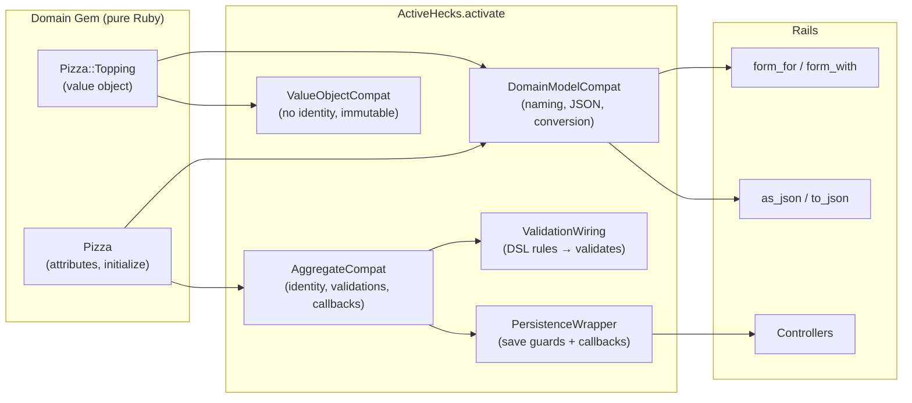
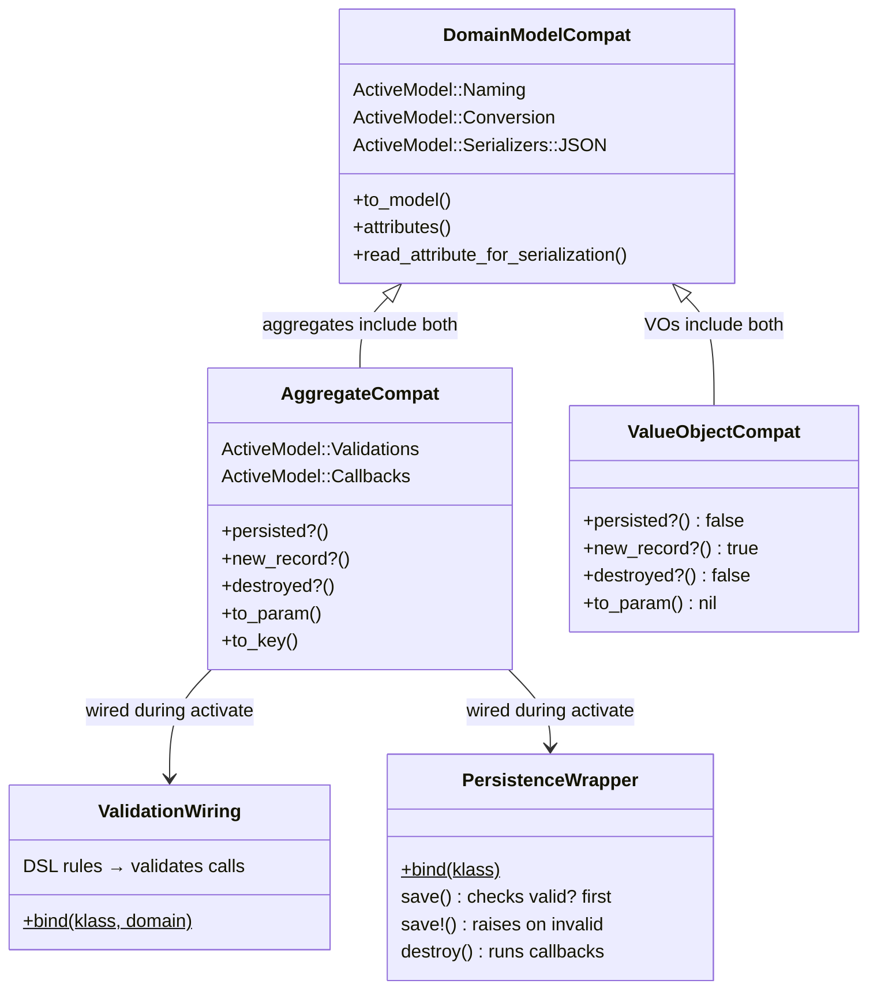

# ActiveHecks — Rails Integration Layer

ActiveHecks bridges generated Hecks domain objects and Rails. It adds ActiveModel compatibility so your domain objects work with forms, validations, JSON serialization, and lifecycle callbacks — without polluting the domain gem itself.

## How It Works



## Activation

One call wires everything up:

```ruby
# In a Rails initializer or after Hecks.configure
ActiveHecks.activate(PizzasDomain)
```

This walks every class in the domain module and includes the right mixins:
- **Aggregates** get full ActiveModel support (validations, callbacks, persistence guards)
- **Value objects** get naming and serialization only (they're frozen, so no validations)

With Rails, activation happens automatically via the Railtie — just call `Hecks.configure` in an initializer.

## Mixin Architecture



### DomainModelCompat

Shared by all domain objects. Adds:
- `ActiveModel::Naming` — `Pizza.model_name` works
- `ActiveModel::Conversion` — `to_model`, `to_partial_path`
- `ActiveModel::Serializers::JSON` — `as_json`, `to_json`
- `attributes` — introspects constructor params

### AggregateCompat

Aggregates only. Adds:
- `ActiveModel::Validations` — `valid?`, `errors`
- `ActiveModel::Callbacks` — `before_save`, `after_create`, etc.
- Identity methods — `persisted?`, `new_record?`, `to_param`, `to_key`

### ValueObjectCompat

Value objects only. Lightweight — no validations (frozen objects can't mutate `@errors`):
- Always `persisted? → false`, `new_record? → true`
- `to_param → nil`, `to_key → nil`

### ValidationWiring

Converts DSL validation rules into ActiveModel `validates` calls:

```ruby
# DSL definition:
validation :name, presence: true

# Becomes at activation time:
Pizza.validates :name, presence: true
```

Also disables the generated `validate!` (which raises in the constructor), so you can build invalid objects and check `valid?` / `errors` the Rails way.

### PersistenceWrapper

Wraps `save` and `destroy` with validation checks and callbacks:

```ruby
pizza.save     # => false if invalid (won't hit the adapter)
pizza.save!    # => raises ActiveModel::ValidationError if invalid
pizza.destroy  # => runs :destroy callbacks, then delegates
```

## Usage in Rails

```ruby
# config/initializers/hecks.rb
Hecks.configure do
  domain "pizzas_domain"
  adapter :sql, database: :postgres, host: "localhost", name: "pizzas"
end

# app/controllers/pizzas_controller.rb
class PizzasController < ApplicationController
  def create
    pizza = Pizza.new(pizza_params)
    if pizza.save
      redirect_to pizza
    else
      render :new  # pizza.errors works with form helpers
    end
  end
end
```

## Railtie

The Railtie handles two things automatically:

1. **Boot** — calls `Hecks.configuration.boot!` after initializers load
2. **Rake tasks**:
   - `rake hecks:generate:migrations` — diff domain snapshots, generate SQL
   - `rake hecks:db:migrate` — apply pending Hecks migrations

## What Stays Out of the Domain

ActiveHecks is intentionally separate from the domain gem. The generated gem stays pure Ruby with zero dependencies. ActiveHecks adds Rails compatibility from the outside — the domain never knows.

| Concern | Domain Gem | ActiveHecks |
|---|---|---|
| Attributes & types | Yes | — |
| Business invariants | Yes | — |
| ActiveModel naming | — | DomainModelCompat |
| JSON serialization | — | DomainModelCompat |
| Validations (`valid?`) | — | AggregateCompat + ValidationWiring |
| Lifecycle callbacks | — | AggregateCompat |
| Save/destroy guards | — | PersistenceWrapper |
| Form helpers | — | DomainModelCompat + AggregateCompat |
