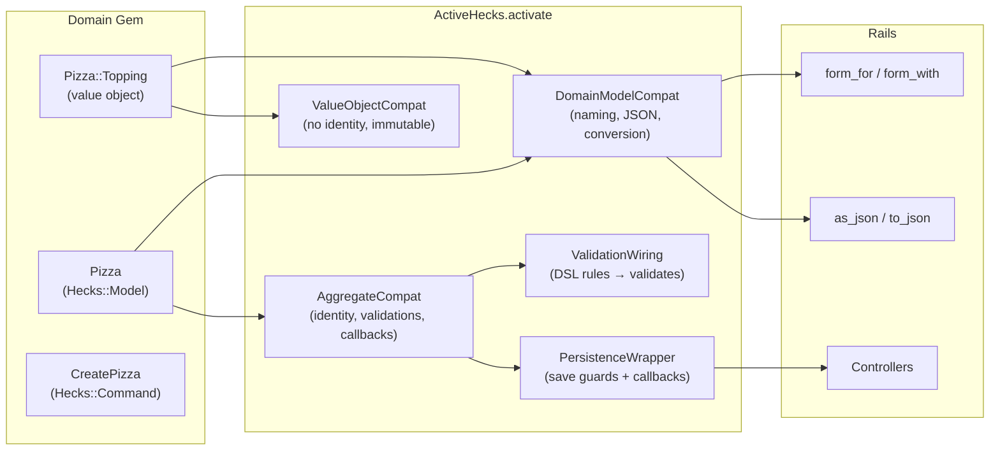

# ActiveHecks — Rails Integration Layer

ActiveHecks bridges generated Hecks domain objects and Rails. It adds ActiveModel compatibility so your domain objects work with forms, validations, JSON serialization, and lifecycle callbacks — without polluting the domain gem itself.

## How It Works



## Activation

One call wires everything up:

```ruby
# In a Rails initializer or after Hecks.configure
ActiveHecks.activate(PizzasDomain)

# Or pass the domain IR for validation wiring from the DSL definition:
ActiveHecks.activate(PizzasDomain, domain: domain_obj)
```

This walks every class in the domain module and includes the right mixins:
- **Aggregates** get full ActiveModel support (validations, callbacks, persistence guards)
- **Value objects** get naming and serialization only (they're frozen, so no validations)

The walker handles nested modules too — if your domain groups aggregates under sub-modules, it recurses into them (skipping `Ports` and `Adapters`). It uses `constants(false)` when scanning for nested value objects, so inherited constants from included modules (like ActiveModel validators) are ignored. It also strips the domain module prefix from `model_name` so `PizzasDomain::Pizza` reports as just `"Pizza"`.

With Rails, activation happens automatically via the Railtie — just call `Hecks.configure` in an initializer.

## Mixin Architecture


### DomainModelCompat

Shared by all domain objects. Adds:
- `ActiveModel::Naming` — `Pizza.model_name` works
- `ActiveModel::Conversion` — `to_model`, `to_partial_path`
- `ActiveModel::Serializers::JSON` — `as_json`, `to_json`
- `attributes` — uses `hecks_attributes` metadata from `Hecks::Model`, falling back to constructor parameters, plus `id`, `created_at`, `updated_at`

### AggregateCompat

Aggregates only. Adds:
- `ActiveModel::Validations` — `valid?`, `errors`
- `ActiveModel::Callbacks` — `before_save`, `after_create`, etc.
- Model callbacks defined for `:save`, `:create`, `:update`, `:destroy`
- Identity methods — `persisted?` (true when `id` is not nil), `new_record?`, `to_param`, `to_key`

### ValueObjectCompat

Value objects only. Lightweight — no validations (frozen objects can't mutate `@errors`):
- Always `persisted? → false`, `new_record? → true`, `destroyed? → false`
- `to_param → nil`, `to_key → nil`

### ValidationWiring

Converts DSL validation rules into ActiveModel `validates` calls. Looks for validations in two places: the class's `domain_def` accessor (set by introspection during wiring), or a passed `domain:` IR object:

```ruby
# DSL definition:
validation :name, presence: true

# Becomes at activation time:
Pizza.validates :name, presence: true
```

Also disables the domain-level `validate!` (which raises in the constructor) so you can build invalid objects and check `valid?` / `errors` the Rails way. Note: `check_invariants!` is not disabled — invariants are structural constraints that still run at construction time.

### PersistenceWrapper

Wraps `save` and `destroy` with validation checks and callbacks. Only binds if the class already has a `save` method (i.e., RepositoryMethods has been wired):

```ruby
pizza.save     # => false if invalid (won't hit the adapter)
pizza.save!    # => raises ActiveModel::ValidationError if invalid
pizza.destroy  # => runs :destroy callbacks, then delegates
```

## Usage in Rails

```ruby
# config/initializers/hecks.rb
Hecks.configure do
  domain "pizzas_domain"
  adapter :sql, database: :postgres, host: "localhost", name: "pizzas"
end

# app/controllers/pizzas_controller.rb
class PizzasController < ApplicationController
  def create
    pizza = Pizza.new(pizza_params)
    if pizza.save
      redirect_to pizza
    else
      render :new  # pizza.errors works with form helpers
    end
  end
end
```

## What a Domain Object Looks Like

With `Hecks::Model`, domain objects are minimal. ActiveHecks layers Rails compatibility on top:

```ruby
# Generated domain gem — pure Ruby, no Rails
class Pizza
  include Hecks::Model

  attribute :name
  attribute :description
  attribute :toppings, default: [], freeze: true
end

# Hecks::Model auto-creates submodules: Commands, Events, Queries, Policies
# These use const_missing for autoloading by convention:
#   Pizza::Commands::CreatePizza  → pizzas_domain/pizza/commands/create_pizza.rb
#   Pizza::Events::CreatedPizza   → pizzas_domain/pizza/events/created_pizza.rb

# After ActiveHecks.activate — gains Rails powers:
pizza = Pizza.new(name: "")
pizza.valid?          # => false
pizza.errors[:name]   # => ["can't be blank"]
pizza.as_json         # => {"id" => "...", "name" => "", ...}
```

## Rails Generators

### `rails generate active_hecks:init`

Detects the `*_domain/` directory in your Rails root and sets up:

1. **Initializer** — `config/initializers/hecks.rb` with `Hecks.configure`
2. **README** — `app/models/HECKS_README.md` explaining the setup (no ActiveRecord models)
3. **Test helper** — injects `require "hecks/test_helper"` into your spec/test helper

### `rails generate active_hecks:migration`

Compares the current domain against a saved snapshot (`.hecks_domain_snapshot.rb`), diffs them with `DomainDiff`, and generates incremental SQL migration files to `db/hecks_migrate/` — separate from ActiveRecord migrations.

## Railtie

The Railtie handles two things automatically:

1. **Boot** — calls `Hecks.configuration.boot!` after initializers load (via `after: :load_config_initializers`)
2. **Rake tasks**:
   - `rake hecks:generate:migrations` — diff domain snapshots, generate SQL
   - `rake hecks:db:migrate` — run pending Hecks SQL migrations (uses `ActiveRecord::Base.connection`)

## What Stays Out of the Domain

ActiveHecks is intentionally separate from the domain gem. The generated gem uses `Hecks::Model`, `Hecks::Command`, and `Hecks::Query` — pure Ruby with no framework dependency. ActiveHecks adds Rails compatibility from the outside — the domain never knows.

| Concern | Domain Gem | ActiveHecks |
|---|---|---|
| Attributes (via DSL) | `Hecks::Model` | — |
| Business invariants | `validate!` / `check_invariants!` | disables `validate!` only |
| Commands | `Hecks::Command` (mixin) | — |
| Queries | `Hecks::Query` (mixin) | — |
| ActiveModel naming | — | DomainModelCompat |
| JSON serialization | — | DomainModelCompat |
| Validations (`valid?`) | — | AggregateCompat + ValidationWiring |
| Lifecycle callbacks | — | AggregateCompat |
| Save/destroy guards | — | PersistenceWrapper |
| Form helpers | — | DomainModelCompat + AggregateCompat |
