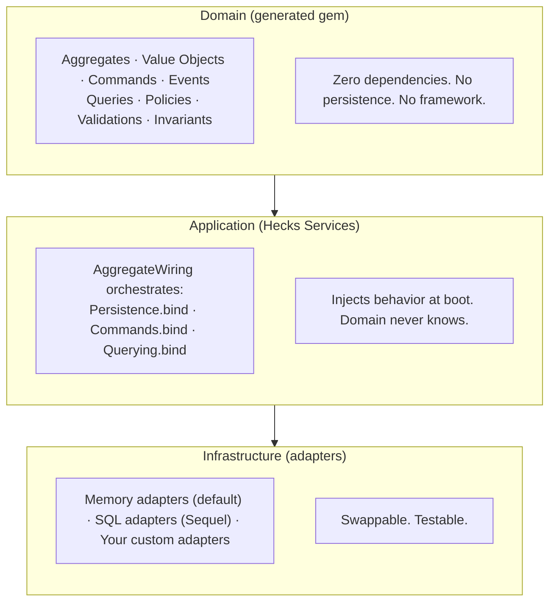

# Hecks for Hexagonal Architecture Enthusiasts

You know the ports and adapters diagram. Here's how Hecks implements it.

## The Layers



## Ports

Hecks generates port interfaces as Ruby modules with `NotImplementedError` stubs:

```ruby
# Generated: pizzas_domain/lib/pizzas_domain/ports/pizza_repository.rb
module PizzasDomain
  module Ports
    module PizzaRepository
      def find(id)    = raise NotImplementedError
      def save(pizza) = raise NotImplementedError
      def delete(id)  = raise NotImplementedError
    end
  end
end
```

Adapters `include` the port to declare compliance. Write a custom adapter, include the port, and the compiler tells you what's missing.

## Adapters

Two built-in, bring your own:

**Memory** — generated by default, zero setup. Hash-backed, perfect for tests:
```ruby
class PizzaMemoryRepository
  include Ports::PizzaRepository
  # @store = {} — that's it
end
```

**SQL** — generated on demand, uses Sequel. Supports SQLite, MySQL, Postgres:
```ruby
class PizzaSqlRepository
  include Ports::PizzaRepository
  # @db[:pizzas].where(id: id).first — Sequel datasets
end
```

**Custom** — implement the port, pass it in:
```ruby
app = Hecks::Services::Application.new(domain) do
  adapter "Pizza", MyRedisRepository.new
end
```

## The .bind Pattern

Each concern is a module group with a `.bind` class method that injects behavior into domain classes at boot time:

```ruby
# Application boot (AggregateWiring):
Persistence.bind(Pizza, agg, repo)   # → find, save, create, delete, collections, references
Commands.bind(Pizza, agg, bus, repo) # → Pizza.create dispatches CreatePizza event
Querying.bind(Pizza, agg)            # → scopes, query objects
```

The domain gem has no knowledge of these modules. The aggregate class starts as pure attributes + validations + invariants. Everything else is injected from the outside.

Dependency inversion without a DI container. No configuration, no registration, no resolution. Just `.bind`.

## Adapter Swapping

Swap adapters without changing domain code.

```ruby
# Tests — memory (automatic, zero config)
app = Hecks::Services::Application.new(domain)
Pizza.create(name: "Test")  # stored in a hash

# Development — SQLite
Hecks.configure do
  domain "pizzas_domain"
  adapter :sql  # SQLite in-memory by default
end

# Production — Postgres
Hecks.configure do
  domain "pizzas_domain"
  adapter :sql, database: :postgres,
    host: "db.prod.internal", name: "pizzas"
end
```

Same domain gem. Same `Pizza.create`. Same query objects. Different infrastructure.

## The QueryBuilder Bridge

The `QueryBuilder` collects query parameters (where, order, limit) and delegates execution to the adapter:

```ruby
Pizza.where(style: "Classic").order(:name).limit(5)
```

- **Memory adapter**: filters `@store.values` with Ruby `select`, `sort_by`, `take`
- **SQL adapter**: builds `SELECT * FROM pizzas WHERE style = 'Classic' ORDER BY name LIMIT 5` via Sequel

Same interface, different execution strategy. The query DSL is the port. Each adapter is the adapter.

## Event Sourcing as an Adapter Concern

Event sourcing is opt-in infrastructure, not a domain concern:

```ruby
adapter :sql, database: :postgres, event_sourced: true
```

The domain doesn't know events are being persisted. The `EventRecorder` hooks into the command dispatch flow and appends events to a `domain_events` table. The domain code is identical either way.

## What Makes This Different

Most "hexagonal architecture" Ruby implementations require:
1. Defining interfaces manually
2. Writing adapters manually
3. Configuring a DI container
4. Wiring everything by hand

Hecks generates the interfaces (ports), generates the default adapters (memory), generates SQL adapters on demand, and wires everything automatically at boot. Describe your domain in a DSL, get a hexagonal architecture for free.

No DI container. No dry-system. No configuration ceremony. Just `.bind`.
