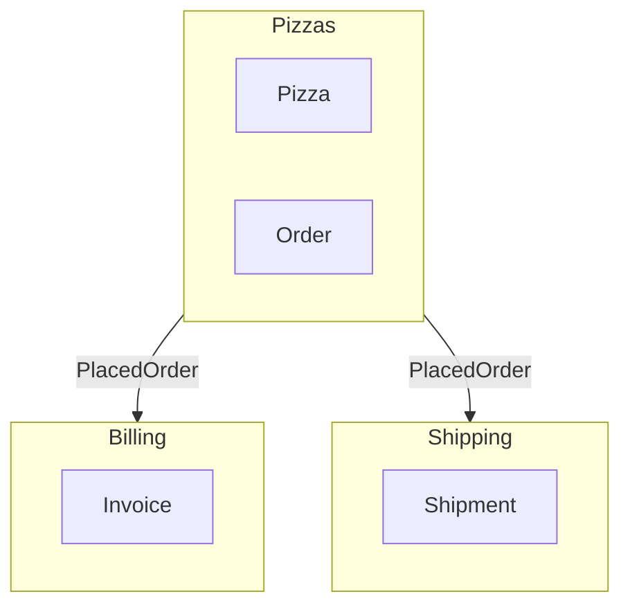

# Context Map

Render a DDD context map showing bounded context relationships across
multiple domains. The map identifies cross-domain event flows, shared
kernels, and upstream/downstream patterns.

## Setup

Place multiple domain Bluebook files in a `domains/` directory:

```
myapp/
  domains/
    pizzas.rb       # Hecks.domain "Pizzas" do ...
    billing.rb      # Hecks.domain "Billing" do ...
    shipping.rb     # Hecks.domain "Shipping" do ...
```

Or run from a directory with a single Bluebook file.

## CLI Usage

```bash
# Text summary (default)
hecks context_map

# Mermaid diagram to stdout
hecks context_map --mermaid

# Open in browser as HTML with live Mermaid rendering
hecks context_map --browser

# Write Mermaid to a file
hecks context_map --output context_map.md
```

## Text Output

```
Bounded Contexts:
  [Pizzas] Aggregates: Pizza, Order
  [Billing] Aggregates: Invoice
  [Shipping] Aggregates: Shipment

Relationships:
  Pizzas --> Billing
    Event: PlacedOrder | Policy: BillOnOrder
  Pizzas --> Shipping
    Event: PlacedOrder | Policy: ShipOnOrder
```

## Mermaid Output

````

````

## Programmatic Usage

```ruby
domains = [pizzas_domain, billing_domain, shipping_domain]
generator = Hecks::ContextMapGenerator.new(domains)

# Mermaid diagram
generator.generate
# => "graph TD\n    subgraph Pizzas[Pizzas]\n    ..."

# Plain text
generator.generate_text
# => "Bounded Contexts:\n  [Pizzas] ..."

# Inspect relationships
generator.relationships
# => [{upstream: "Pizzas", downstream: "Billing", event: "PlacedOrder", ...}]

# Identify shared kernels
generator.shared_kernels
# => ["Pizzas"]  (referenced by 2+ domains)
```

## How Relationships Are Detected

1. **Event flows**: Reactive policies that listen for an event originating
   in a different domain create an upstream/downstream relationship.
2. **Shared kernels**: Domains referenced by two or more other domains
   via attribute naming conventions (e.g. `pizza_id`) are flagged as
   shared kernels and highlighted in the Mermaid diagram.
