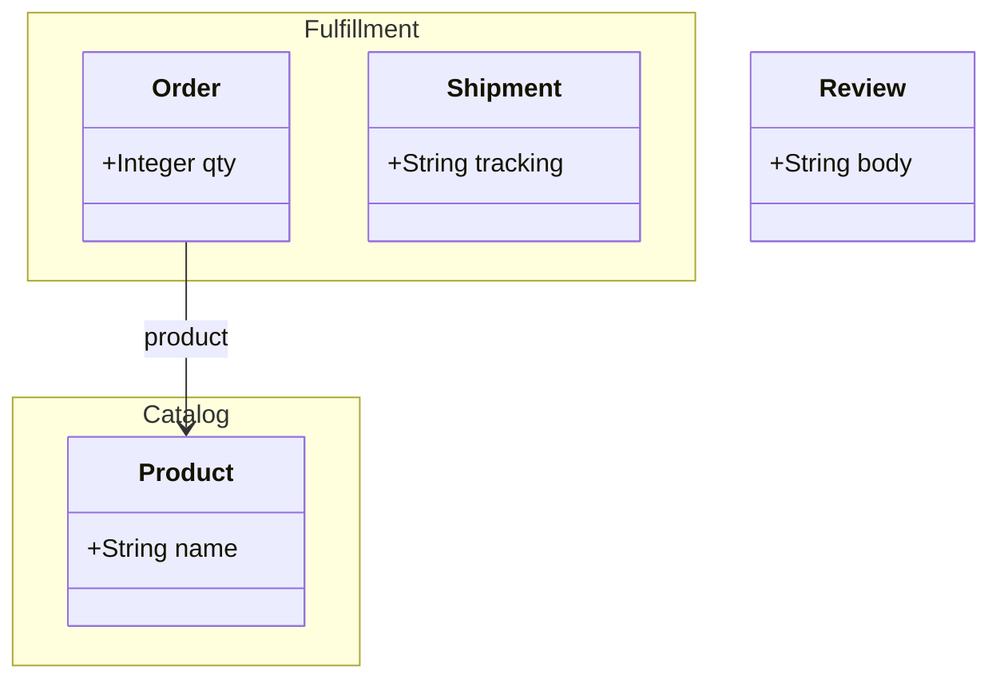
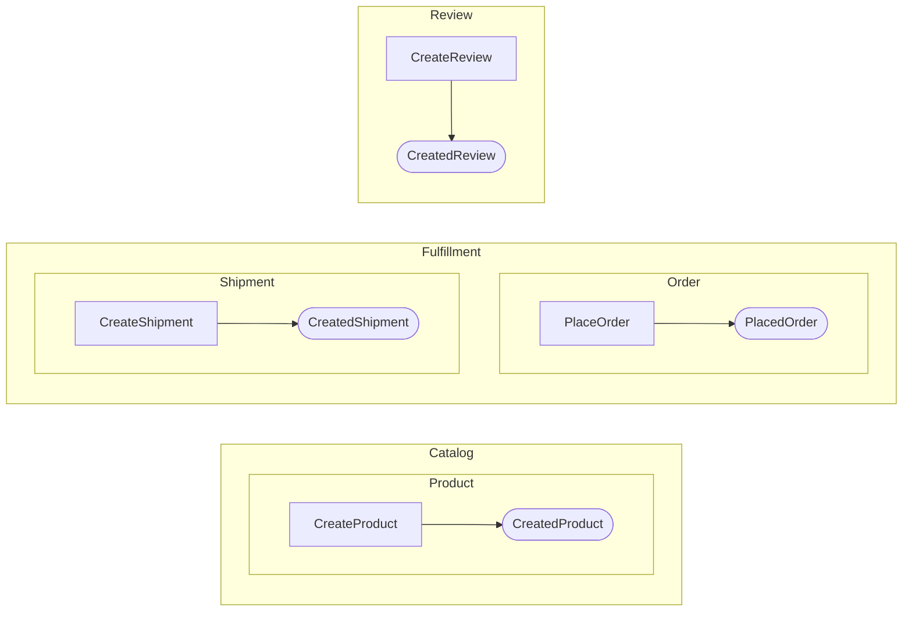

# Domain Modules

Group related aggregates under named modules within a domain. Modules are
a logical namespace overlay -- aggregates still live flat on `domain.aggregates`,
but the module grouping drives Mermaid diagram layout and DSL serialization.

## DSL

```ruby
Hecks.domain "ECommerce" do
  domain_module "Catalog" do
    aggregate "Product" do
      attribute :name, String
      command("CreateProduct") { attribute :name, String }
    end
  end

  domain_module "Fulfillment" do
    aggregate "Order" do
      attribute :qty, Integer
      reference_to "Product"
      command("PlaceOrder") { attribute :qty, Integer }
    end

    aggregate "Shipment" do
      attribute :tracking, String
      command("CreateShipment") { attribute :tracking, String }
    end
  end

  # Aggregates outside any module are ungrouped
  aggregate "Review" do
    attribute :body, String
    command("CreateReview") { attribute :body, String }
  end
end
```

## Querying modules

```ruby
domain = Hecks.domain "ECommerce" do ... end

domain.modules
# => [#<DomainModule name="Catalog" ...>, #<DomainModule name="Fulfillment" ...>]

domain.module_for("Order")
# => #<DomainModule name="Fulfillment" aggregate_names=["Order", "Shipment"]>

domain.module_for("Review")
# => nil  (ungrouped)
```

## Visualization

Modules appear as Mermaid `namespace` blocks in the structure diagram and
nested `subgraph` blocks in the behavior diagram:

```ruby
puts domain.to_mermaid
```

Structure output (classDiagram):



Behavior output (flowchart LR):



## Serialization round-trip

```ruby
source = Hecks::DslSerializer.new(domain).serialize
restored = eval(source)
restored.modules.first.name  # => "Catalog"
```
