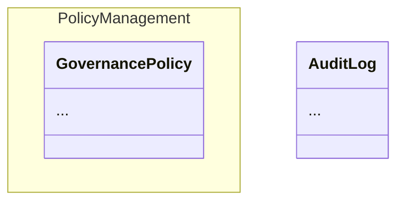

# Domain Modules -- Namespace Grouping

Group related aggregates into logical modules within a domain using
`domain_module`. Modules are an organizational tool -- they affect
visualization and serialization but not runtime behavior.

## DSL

```ruby
Hecks.domain "Governance" do
  domain_module "PolicyManagement" do
    aggregate "GovernancePolicy" do
      attribute :title, String
      command "CreateGovernancePolicy" do
        attribute :title, String
      end
    end
  end

  aggregate "AuditLog" do
    attribute :entry, String
    command "CreateAuditLog" do
      attribute :entry, String
    end
  end
end
```

## Usage

```ruby
domain = Hecks.domain("Governance") { ... }

# Find which module contains an aggregate
domain.module_for("GovernancePolicy")
# => #<DomainModule name="PolicyManagement" ...>

domain.module_for("AuditLog")
# => nil  (ungrouped)

# Modules are proper IR nodes
mod = domain.modules.first
mod.name        # => "PolicyManagement"
mod.aggregates  # => ["GovernancePolicy"]
```

## Visualization

The Mermaid structure diagram groups aggregates by module using
`namespace` blocks:



## Serialization

`DslSerializer` emits `domain_module` blocks with their aggregates
nested inside. Ungrouped aggregates appear at the top level.
