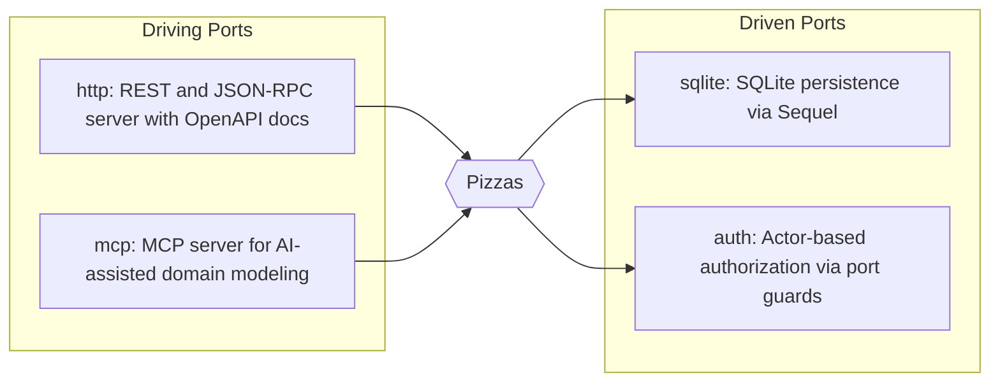

# Port Visualization

Show the hexagonal architecture of your domain: driving ports on the left, the domain in the center, and driven ports on the right.

## CLI Usage

```bash
# Generate the port diagram
hecks visualize --type ports

# Open in browser
hecks visualize --type ports --browser

# Write to file
hecks visualize --type ports --output ports.md
```

## Example Output

Given a Pizzas domain with HTTP, MCP (driving) and SQLite, Auth (driven) extensions:



## Programmatic Usage

```ruby
domain = Hecks.domain("Pizzas") { aggregate("Pizza") { attribute :name, String } }
viz = Hecks::DomainVisualizer.new(domain)

# Uses Hecks.extension_meta automatically
puts viz.generate_ports

# Or pass explicit extension metadata for testing
puts viz.generate_ports(extensions: {
  http: { description: "REST server", adapter_type: :driving },
  sqlite: { description: "SQLite persistence", adapter_type: :driven }
})
```

## How It Works

The port diagram reads from `Hecks.extension_meta`, which is populated by each extension's `Hecks.describe_extension` call. Extensions declare themselves as `:driving` (inbound adapters like HTTP, CLI, MCP) or `:driven` (outbound adapters like persistence, auth, logging).

Arrows show data flow direction: driving ports push data into the domain, and the domain pushes data out to driven ports.
