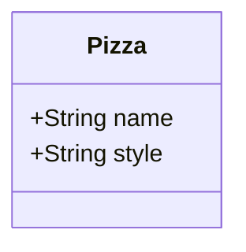
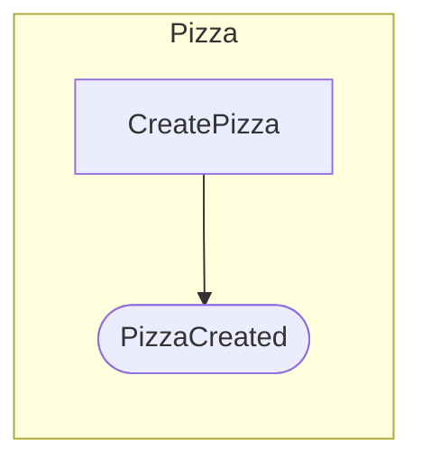

# hecks visualize

Generate Mermaid diagrams from your Hecks domain definition. Output to stdout, a file, or an HTML page in the browser.

## Usage

```bash
# Print all diagrams to stdout (classDiagram + flowchart)
hecks visualize

# Print only the structural class diagram
hecks visualize --type structure

# Print only the behavioral flowchart
hecks visualize --type behavior

# Print the reactive flow sequence diagram
hecks visualize --type flows

# Print the vertical slice flowchart
hecks visualize --type slices

# Open a self-contained HTML page with Mermaid rendering in the browser
hecks visualize --browser

# Write the diagram to a file
hecks visualize --output diagram.md
hecks visualize --type structure --output structure.md
```

## Example Output

Given a Pizzas domain with a `Pizza` aggregate:

```
hecks visualize --type structure
```



```
hecks visualize --type behavior
```



## Diagram Types

| Type | Mermaid keyword | Shows |
|------|-----------------|-------|
| `structure` | `classDiagram` | Aggregates, attributes, value objects, entities, references |
| `behavior` | `flowchart LR` | Command-to-event flows, policy links |
| `flows` | `sequenceDiagram` | Reactive chains traced from entry commands |
| `slices` | `flowchart LR` | Vertical slices as labeled subgraphs |
| (default) | both | `structure` + `behavior` diagrams |

## Browser Mode

`--browser` writes a self-contained HTML file to a system temp directory and opens it with `open`. The page uses the Mermaid CDN to render diagrams interactively.
